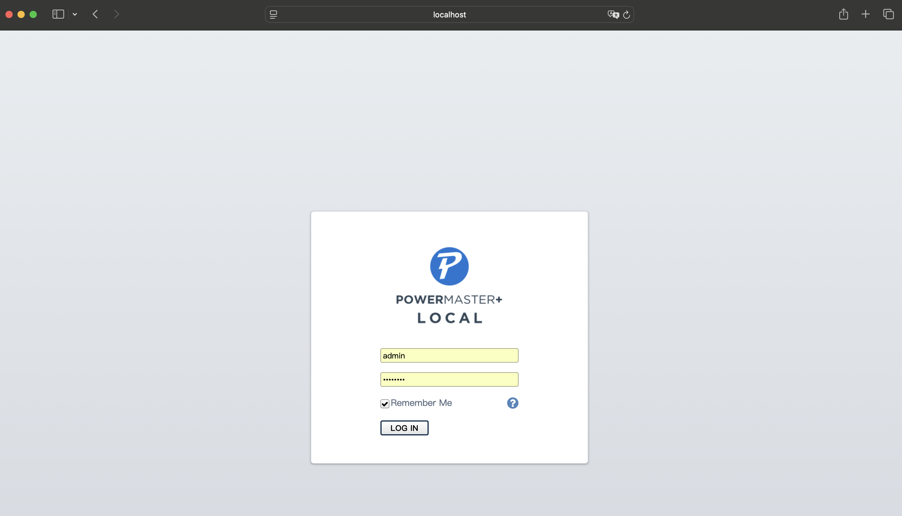

# NON-official Atlantis-Land PowerMaster Plus container image

This project provides a Dockerized environment for running PowerMaster Plus, the official monitoring and management software for Atlantis Land UPS devices.

The aim is to allow users to operate PowerMaster Plus without needing to install it directly on a host system, enabling easier deployment, portability, and compatibility across different Linux environments. This is especially useful in scenarios where the original software is designed for legacy platforms or where isolation is preferred.

⚠️ Note: This project is not affiliated with Atlantis Land and does not include proprietary software. The user is responsible for providing any required installation files or licenses for PowerMaster Plus.


## Prerequisites

Before building (and running) this container image, ensure you have the following:

- Docker installed on your Linux host system (version 20.10 or newer recommended).

- Access to the PowerMaster Plus Linux installer (should be something like pmasterp122-linux-x86_x64.sh) in the same directory where the Dockerfile is.

- A compatible Atlantis Land UPS device connected to the host machine via USB or serial port.

- Proper permissions to access the UPS device from inside the container (e.g., via /dev/ttyUSB*, /dev/hidraw*, or similar).
    
- Optional but recommended: Membership in the docker group to run containers without sudo.

⚠️ Note: You are responsible for obtaining and using the PowerMaster Plus software in compliance with its licensing terms.

## Build the image

Build the image:

```console
docker build \
    --build-arg PACKAGE_NAME=pmasterp122-linux-x86_x64.sh \
    -t atlantisland-powermasterplus \
    .
```

## Run the container

Run as a priviledged container (you may change the `--device` value according to your USB hid device):

``` console
docker run \
    -ti \
    -p 3052:3052 \
    --privileged \
    --device=/dev/hidraw0 \
    atlantisland-powermasterplus
```

## Use the software

After the container has started, point your browser to the container host address, port 3052, to see the login page:



## ⚠️ Notice of Non-Affiliation and Responsibility

This Docker image is provided solely for compatibility and convenience purposes. It is designed to facilitate the execution of software components originally intended for use on a specific hardware device, within a containerized environment.

Please note:

- We are not the developers, owners, or maintainers of the original device or its software/s.

- This project is not affiliated with, endorsed by, or supported by the manufacturer or any entity responsible for the original device.

- The use of this Docker image is entirely at your own risk. We make no guarantees about performance, compatibility, or correctness.

- This image does not contain any proprietary software; it is assumed that any required files from the device are obtained and used legally and appropriately by the end user.

- This project does not attempt to bypass any security mechanisms or licensing restrictions.

By using this Docker image, you agree that we assume no liability for any consequences related to its use.

## Tested configuration

- **Host OS**: Ubuntu 22.04.5 LTS
- **Host HW**: x86_64
- **Container runtime**: Docker Community 27.4.0

 **Warning:** If you’re running your Docker container on top of a virtual machine (using Podman or Docker Desktop), and the USB-connected device (e.g., a UPS using HID over USB) is not passed through to the VM, the container may not see it! 